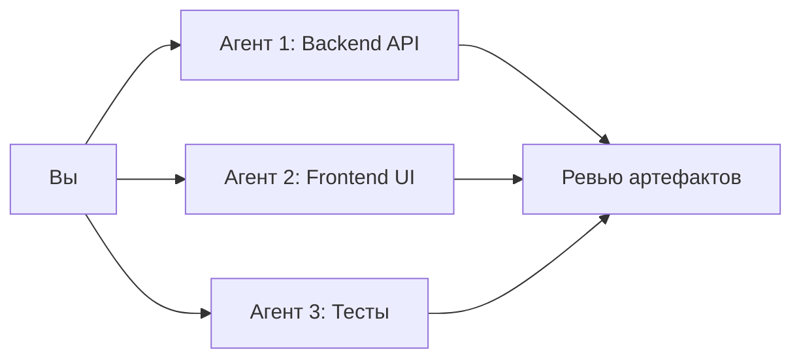

# 🚀 Полное руководство по эффективному использованию Google Antigravity

> Antigravity — **агент-ориентированная IDE** от Google, выпущенная в ноябре 2025. Она основана на VS Code, но принципиально отличается: в центре — автономные AI-агенты (Gemini 3 Pro / Claude / GPT-OSS), которые планируют, пишут код, тестируют и отлаживают проекты самостоятельно.

---

## 1. Ключевые концепции

### Dual View — два интерфейса

| Вид | Назначение |
|-----|-----------|
| **Editor View** | Классический редактор кода + боковая панель агента для синхронной работы |
| **Manager View** | «Mission Control» — оркестровка множества агентов параллельно, асинхронно, по разным воркспейсам |

### Три режима автономии

| Режим | Описание | Когда использовать |
|-------|----------|--------------------|
| **Agent-driven** | Полный автопилот; агент сам планирует и исполняет | Прототипы, boilerplate-задачи |
| **Agent-assisted** ⭐ | Совместная работа; агент помогает, вы контролируете | Рекомендуется для повседневной разработки |
| **Review-driven** | Агент спрашивает разрешение перед каждым действием | Продакшн, критичные рефакторинги |

### Artifacts — прозрачность работы агента

Агент генерирует «артефакты» — проверяемые отчёты о своей работе:

- **Task List** — чеклист задач (`task.md`)
- **Implementation Plan** — технический план изменений
- **Code Diffs** — различия в коде
- **Screenshots & Recordings** — скриншоты и видеозаписи браузера
- **Walkthroughs** — итоговые отчёты с доказательствами

> [!TIP]
> Всегда проверяйте артефакты **до** одобрения кода. Ревью на уровне плана экономит часы отладки.

---

## 2. Установка и первый запуск

1. Скачайте установщик: [antigravity.google](https://antigravity.google)
2. Запустите и пройдите настройку:
   - Привяжите Google-аккаунт
   - Выберите «Start fresh» или импорт настроек из VS Code
   - Выберите тему оформления
   - Установите режим разработки (рекомендуется **Agent-assisted**)
3. При запросе — установите **браузерное расширение Antigravity** (необходимо для автотестирования агентами)

---

## 3. Эффективная работа с агентами

### 3.1 Как правильно формулировать задачи

```
❌ Плохо:  "Сделай мне сайт"
✅ Хорошо: "Создай лендинг на React + Tailwind с 3 секциями: Hero (с анимированным заголовком), 
            Features (карточки с иконками), Footer. Используй тёмную тему, шрифт Inter."
```

**Принципы эффективного промпта:**

| Элемент | Описание | Пример |
|---------|----------|--------|
| **Instruction** | Что сделать | «Создай REST API для пользователей» |
| **Context** | Фон и ограничения | «Используй NestJS + Drizzle ORM, база PostgreSQL» |
| **Input Data** | Конкретные данные | «Поля: name, email, role (enum: admin/user)» |
| **Output** | Ожидаемый результат | «Верни OpenAPI-спецификацию и рабочий сервер» |

### 3.2 Planning vs Fast Mode

| Режим | Плюсы | Минусы | Когда использовать |
|-------|-------|--------|-------------------|
| **Planning** | Создаёт план → ревью → код | Медленнее | Сложные задачи, архитектурные решения, рефакторинги |
| **Fast** | Сразу пишет код | Нет плана для ревью | Простые задачи, hotfix, ответы на вопросы |

> [!IMPORTANT]
> Для любой задачи, затрагивающей > 3 файлов, используйте **Planning Mode**.

### 3.3 Параллельная оркестровка

В **Manager View** можно запустить несколько агентов одновременно:



**Совет:** давайте каждому агенту свой воркспейс/папку для избежания конфликтов.

---

## 4. Кастомизация: Rules, Workflows, Skills

### 4.1 Rules — правила поведения агента

Правила — это Markdown-файлы, которые управляют поведением агента.

| Тип | Расположение | Область действия |
|-----|-------------|-----------------|
| Глобальные | `~/.gemini/GEMINI.md` | Все проекты |
| Проектные | `.agent/rules/*.md` | Конкретный воркспейс |

**Режимы активации:**

- **Always On** — всегда подключены
- **Manual** — вручную
- **Model Decision** — AI решает сам
- **Glob** — по паттерну файлов (например `*.tsx`)

**Пример правила** `.agent/rules/code-style.md`:
```markdown
---
description: Правила оформления кода
alwaysApply: true
---
- Всегда используй TypeScript strict mode
- Комментарии на русском языке
- Никогда не используй `any`
- Используй функциональные компоненты React
- Имена переменных — camelCase, константы — UPPER_SNAKE_CASE
```

### 4.2 Workflows — переиспользуемые сценарии

Workflows — это сохранённые промпты, вызываемые командами `/имя`.

| Тип | Расположение |
|-----|-------------|
| Глобальные | `~/.gemini/antigravity/global_workflows/` |
| Проектные | `.agent/workflows/` |

**Пример** `.agent/workflows/review.md`:
```markdown
---
description: Запуск код-ревью текущих изменений
---
1. Выполни `git diff --cached` для получения staged изменений
2. Проанализируй каждый файл на:
   - Потенциальные баги
   - Нарушения стиля кода
   - Проблемы с производительностью
   - Отсутствие тестов
3. Сформируй отчёт с рекомендациями
```

Использование: введите `/review` в чате агента.

### 4.3 Skills — специализированные навыки

Skills расширяют возможности агента, превращая его из «генералиста» в «специалиста».

| Тип | Расположение |
|-----|-------------|
| Глобальные | `~/.gemini/antigravity/skills/` |
| Проектные | `.agent/skills/` |

**Структура навыка:**
```
.agent/skills/
└── my-skill/
    ├── SKILL.md          # Инструкции (обязательно)
    ├── scripts/          # Скрипты-помощники
    ├── examples/         # Примеры использования
    └── resources/        # Шаблоны, ресурсы
```

**Пример** `.agent/skills/deploy/SKILL.md`:
```markdown
---
name: deploy
description: Деплой приложения на production-сервер
---
# Deploy Skill

## Шаги деплоя:
1. Проверь все тесты: `npm test`
2. Собери production-бандл: `npm run build`
3. Загрузи на сервер через rsync
4. Проверь healthcheck endpoint
```

> [!NOTE]
> Навык загружается в контекст **только когда нужен** — это экономит контекстное окно.

---

## 5. Builder-in Browser — встроенный браузер

Агенты могут использовать браузер для:

- ✅ Автоматического тестирования UI
- ✅ Снятия скриншотов для артефактов
- ✅ Записи видео взаимодействий
- ✅ Верификации вёрстки и функционалности

**Ваши настройки безопасности:**

- **Allow List** — разрешённые домены
- **Deny List** — запрещённые домены

---

## 6. MCP Серверы — интеграция с внешними сервисами

Model Context Protocol позволяет подключить агента к:

| Сервис | Применение |
|--------|-----------|
| **GitHub** | Работа с issues, commits, PR |
| **Базы данных** | BigQuery, AlloyDB, Cloud SQL, SQLite |
| **Облака** | Google Cloud Deploy, AWS |
| **API** | Любые REST/GraphQL API |
| **Веб-поиск** | SearXNG, встроенный поиск |

---

## 7. AntigravityManager — менеджер аккаунтов

Если вы используете несколько Google/Claude аккаунтов, [AntigravityManager](https://github.com/Draculabo/AntigravityManager) — desktop-приложение для:

| Возможность | Описание |
|-------------|----------|
| 🔄 Автосмена аккаунтов | При исчерпании квоты (<5%) автоматически переключается |
| 📊 Мониторинг квот | Визуальные прогресс-бары по каждой модели |
| 🔐 Безопасность | AES-256-GCM шифрование токенов |
| 🔌 API Proxy | Локальный прокси, совместимый с OpenAI/Anthropic API |
| 💾 Бэкап аккаунтов | Снапшоты состояния аккаунтов |

---

## 8. ТОП-10 советов для максимальной эффективности

### 1️⃣ Начинайте с Planning Mode
Для задач с 3+ файлами всегда используйте Planning Mode. Ревью плана экономит часы.

### 2️⃣ Один промпт — одна задача
Не смешивайте несвязанные задачи. «Добавь авторизацию и поправь CSS кнопки» — это два запроса.

### 3️⃣ Ревьюте артефакты, а не только код
Implementation Plan → Task List → Walkthrough — путь от замысла к результату.

### 4️⃣ Используйте параллельных агентов
Backend, Frontend и тесты — три агента параллельно через Manager View.

### 5️⃣ Создайте свои Rules
Настройте стиль кода, язык комментариев, запрещённые паттерны — один раз.

### 6️⃣ Автоматизируйте через Workflows
`/test`, `/review`, `/deploy` — превратите рутину в одну команду.

### 7️⃣ Выбирайте модель под задачу
- **Gemini 3 Pro** — Google APIs, сложная логика, большие контексты
- **Claude Sonnet/Opus** — разговорное общение, рефакторинг, документация
- **Gemini 3 Flash** — быстрые ответы, мелкие правки

### 8️⃣ Пишите AGENTS.md для проекта
Файл с техническим контекстом проекта делает агента умнее:
```markdown
# AGENTS.md
- Tech Stack: React 19 + TypeScript + Tailwind v4
- Пакетный менеджер: npm (только npm!)
- Тесты: Vitest (unit) + Playwright (e2e)
- База данных: Better-SQLite3
- Стиль: компоненты в PascalCase, утилиты в camelCase
```

### 9️⃣ Итерируйте через фидбек
Оставляйте комментарии прямо на артефактах (как в Google Docs). Агент учтёт их.

### 🔟 Настройте безопасность
- Deny List для браузера — блокируйте чувствительные домены
- Не передавайте секреты в промптах
- Используйте `.env` для конфигурации

---

## 9. Чеклист для нового проекта

```markdown
- [ ] Создать `.agent/rules/` с правилами кода и стиля
- [ ] Создать `.agent/workflows/` с ключевыми сценариями (test, review, deploy)
- [ ] Написать AGENTS.md с описанием стека и конвенций
- [ ] Настроить MCP-серверы (если нужны внешние интеграции)
- [ ] Выбрать режим автономии (рекомендуется Agent-assisted)
- [ ] Настроить Allow/Deny List для браузера
- [ ] Создать skills для специфичных операций проекта
```

---

## 10. Горячие клавиши и команды

| Действие | Как сделать |
|----------|------------|
| Открыть чат агента | Боковая панель → Agent |
| Переключить на Manager View | Верхнее меню → Manager |
| Вызвать Workflow | Ввести `/имя-workflow` в чате |
| Переключить модель | Выпадающий список модели в чате |
| Включить Planning Mode | Настройки агента → Planning |
| Остановить агента | Кнопка «Stop» в панели агента |

---

> [!CAUTION]
> Antigravity — мощный инструмент, но помните: **вы — архитектор, агент — исполнитель**. Всегда проверяйте критичные изменения вручную, особенно в продакшн-коде.
